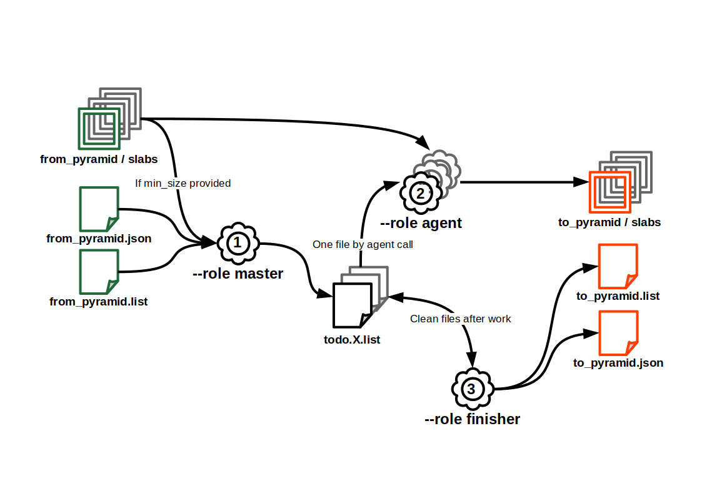

# Outils Python

Ce projet contient des outils de gestion des pyramides de données, écrits en Python.

- [Compilations](#compilations)
  - [Outils](#outils)
  - [Documentation](#documentation)
- [Installation](#installation)
- [PYR2PYR](#pyr2pyr)
  - [Fonctionnement](#fonctionnement)
  - [Configuration](#configuration)


## Compilations

### Outils

`VERSION=1.0.0 python setup.py bdist_wheel`

### Documentation

```sh
pip install json-schema-for-humans pdoc3 jsonschema2md
mkdir html
generate-schema-doc bin/*.schema.json ./html/
```

## Installation

Récupération des artefacts sur GitHub :

* [Fichier Wheel des librairies](https://github.com/rok4/core-python/releases)
* [Fichier Wheel des outils](https://github.com/rok4/pytools/releases)

Installation dans un environnement :

```sh
sudo apt install python3-rados
python -m venv --system-site-packages venv
source venv/bin/activate
pip install rok4lib-<VERSION>-py3-none-any.whl
pip install rok4tools-<VERSION>-py3-none-any.whl
```

Installation système :

```sh
sudo apt install python3-rados
sudo pip install rok4lib-<VERSION>-py3-none-any.whl
sudo pip install rok4tools-<VERSION>-py3-none-any.whl
```

## PYR2PYR

PYR2PYR est un outil de copie d'une pyramide d'un stockage à un autre. Il est possible de filtrer les dalles transférée en précisant une taille limite sous laquelle les données ne sont pas recopiées. La copie des dalles est parallélisable. Si des signatures MD5 sont présente dans le fichier liste, elles sont contrôlées après recopie.

Un exemple de configuration est affichable avec la commande `pyr2pyr.py --role example` et l'appel `pyr2pyr.py --role check --conf conf.json` permet de valider un fichier de configuration. Le fichier de configuration peut être un objet, auquel cas le chemin doit être préfixé par le type de stockage (exemple : `s3://bucket/configuration.json`)

### Fonctionnement

Une copie complète d'une pyramide implique l'utilisation de l'outil avec les 3 modes suivants, dans cet ordre (tous les modes utilisent le fichier de configuration) :

1. Rôle `master`
   * Actions : génération des N TODO lists, déposé dans un dossier précisé dans la configuration (peut être un stockage objet).
   * Appel : `pyr2pyr.py --role master --conf conf.json`
2. Rôle `agent` : 
   * Actions : lecture de la TODO list depuis le dossier de traitement et recopie des dalles
   * Appel (un appel par TODO list) : `pyr2pyr.py --role agent --conf conf.json --split X`
3. Rôle `finisher` : 
   * Actions : lecture des TODO lists pour écrire le fichier liste final et écriture du descripteur de la pyramide en sortie.
   * Appel : `pyr2pyr.py --role finisher --conf conf.json`



### Configuration

Possibilités de contenu du fichier JSON (généré à partir du schéma JSON avec `jsonschema2md bin/pyr2pyr.schema.json /dev/stdout`)

- **`logger`** *(object)*: Logger configuration.
  - **`layout`** *(string)*: Log format, according to logging python library. Default: `%(asctime)s %(levelname)s: %(message)s`.
  - **`file`** *(string)*: Path to log file. Standard output is used if not provided.
  - **`level`** *(string)*: Log level. Must be one of: `['DEBUG', 'INFO', 'WARNING', 'ERROR', 'CRITICAL', 'NOTSET']`. Default: `WARNING`.
- **`from`** *(object)*: Pyramid to copy.
  - **`descriptor`** *(string)*: Path to pyramid's descriptor to copy.
- **`to`** *(object)*: Pyramid to write.
  - **`name`** *(string)*: Output pyramid's name.
  - **`storage`** *(object)*
    - **`type`** *(string)*: Storage type. Must be one of: `['FILE', 'S3', 'CEPH']`.
    - **`root`** *(string)*: Storage root : a directory for FILE storage, pool name for CEPH storage, bucket name for S3 storage.
    - **`depth`** *(integer)*: Tree depth, only for FILE storage. Minimum: `1`. Default: `2`.
- **`process`** *(object)*: Processing parameters.
  - **`directory`** *(string)*: Directory to write copies to process, FILE directory or S3/CEPH prefix.
  - **`parallelization`** *(integer)*: Parallelization level, number of todo lists and agents working at the same time. Minimum: `1`. Default: `1`.
  - **`follow_links`** *(boolean)*: Do we follow links (data slabs in others pyramids than the 'from' one). Default: `False`.
  - **`slab_limit`** *(integer)*: Minimum slab size (if under, we do not copy). Minimum: `0`. Default: `0`.